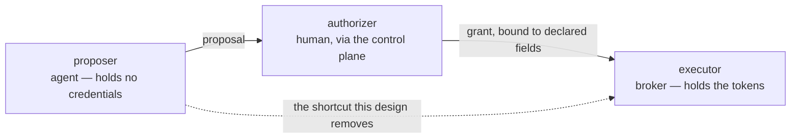
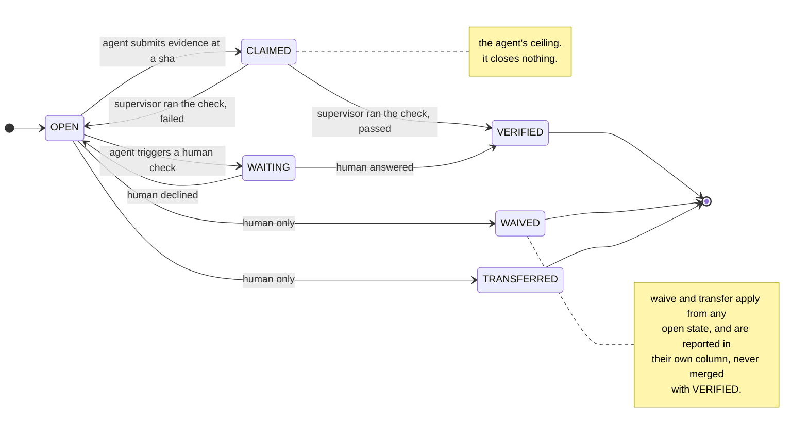
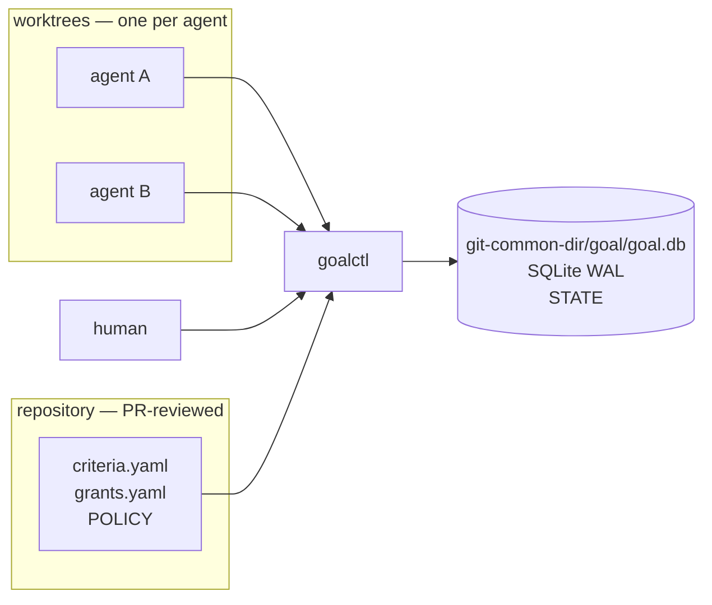
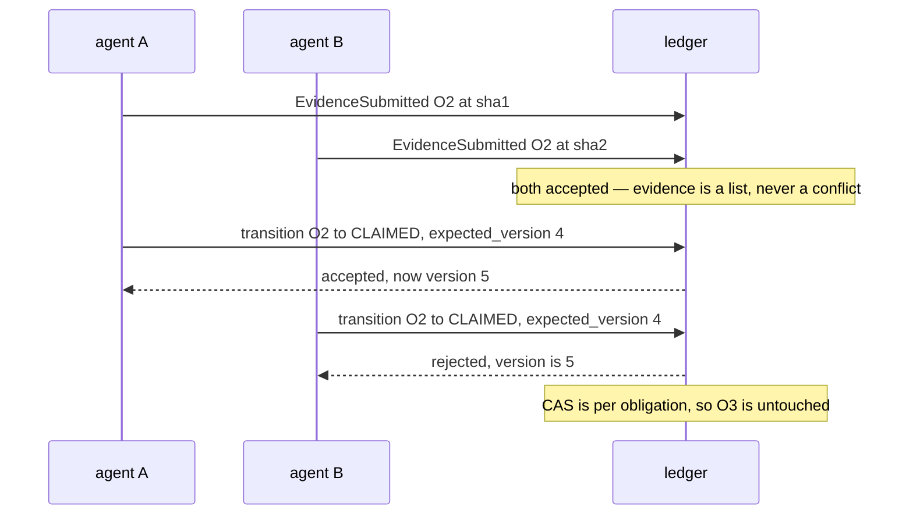
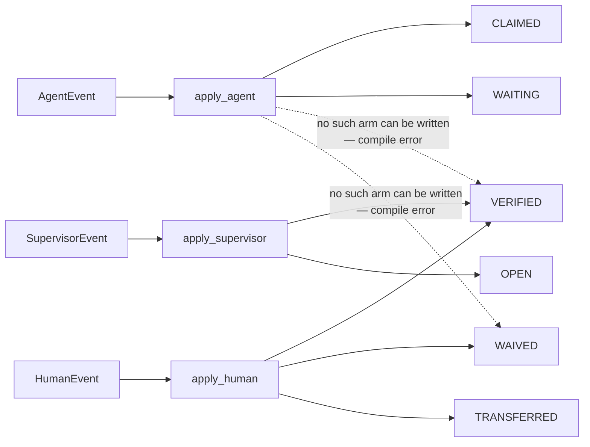
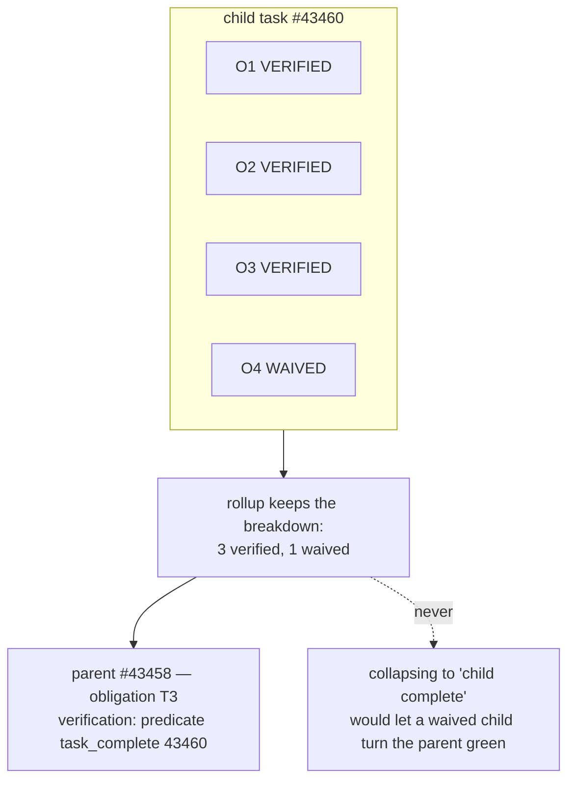
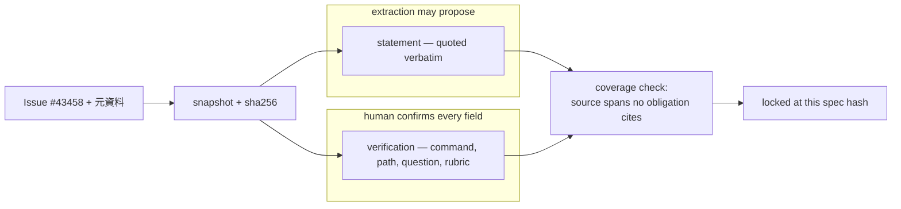
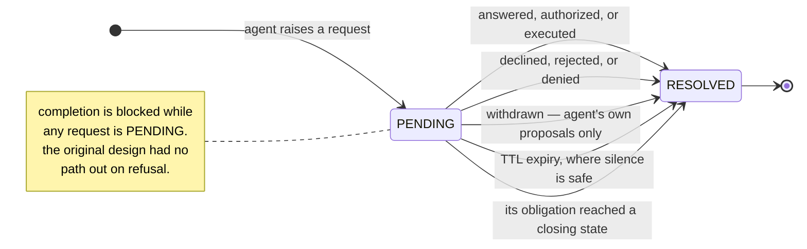

# Goal Supervisor — Design

Decisions and deltas from the original proposal. Not a restatement of it. Design only.

## 1. Why not a phase machine

| # | Incident | Fix |
|---|----------|-----|
| 1 | Unagreed points pushed to a separate Issue | A ledger the agent cannot rewrite, plus human-only closure |
| 2 | Doc update / issue close / worktree on its own | Effect mediation |
| 3 | Self-declared "all resolved" | Completion computed against the source, not spoken |

The phase machine fixes none of the three. All three are one missing separation: the agent holds both the work and the definition of the work.



`phase = f(obligations)`. The proposal's §4 already wrote completion as a predicate over obligations, which *is* a derived phase; storing a `phase` field beside the ledger gives two answers to one question, and their disagreement is incident 3. `CREATED` / `CANCELLED` / `DONE` follow from whether one event exists, `WAITING_DECISION` from whether a request is pending, `WORKING` means "none of the others". The remaining two were never phases: `VERIFYING` is a lock, `READY_FOR_REVIEW` an authorization record.

**Per-obligation state is stored. Task-level phase is not.** These are not in tension: the information lives in the obligations, and the phase is a reading of them.

## 2. Obligation states

| State | Reached by | Counts as closed |
|-------|-----------|:----------------:|
| `OPEN` | initial; a check failed; a clarifying answer landed | no |
| `CLAIMED` | **agent** submits evidence | **no** |
| `WAITING` | **agent** triggers a `human`-type check | no |
| `VERIFIED` | **supervisor**, after running the check itself | yes |
| `WAIVED` | **human** only | yes — reported separately |
| `TRANSFERRED` | **human** only | yes — reported separately |



`FAILED` is deliberately not a state: the next action is identical to `OPEN`, so the failure is recorded in the log instead of doubling the state space.

`CLAIMED` is the agent's ceiling. Of the three closing states, two are human-only and the third requires the supervisor to have executed the check. **No path exists by which the agent closes an obligation.**

Completion never collapses the distinction: a report reads *"3 verified, 1 transferred to #2645"*, never *"4 done"*. That is the answer to incident 1.

## 3. Storage

### 3.1 Location — verified, not assumed

```
$(git rev-parse --path-format=absolute --git-common-dir)/goal/
```

Confirmed by measurement: the main checkout and a `git wt` worktree return the same absolute path. This location is shared across every worktree of a clone, untracked, and survives branch switches.

**A `.goal/` directory inside the repo does not work** and the earlier proposal to make it a PR-reviewed file is withdrawn. Each worktree would get its own copy, they would diverge under parallel agents, and the audit log would need git conflict resolution.

Policy and state separate cleanly, which lets both mechanisms stand:




| | Where | Authority comes from |
|---|---|---|
| **Policy** — `criteria.yaml`, `grants.yaml` | in the repo | PR review |
| **State** — the ledger | `git-common-dir` | file ownership and the CLI |

### 3.2 SQLite, because the stated trigger fired

An earlier section listed SQLite under "not adopted — revisit when two or more writers contend on one task." Multiple agents and humans on one task is that condition. The switch is a consequence of the requirement, not a change of preference.

JSONL was rejected on specifics: appends to a regular file are not guaranteed atomic past `PIPE_BUF`, and `flock` is advisory. SQLite in WAL mode genuinely serializes writers on one host.

```
PRAGMA journal_mode = WAL;   PRAGMA busy_timeout = 5000;
BEGIN IMMEDIATE;             -- every write starts here
-- one event per transaction
```

**One database, not one per task** — §6's cross-task predicates require it. Writes are small and rare, so a serialized writer is not a bottleneck.

## 4. Concurrency

The simplification that makes this cheap: **evidence never conflicts.**

```
EvidenceSubmitted   append-only. Several agents on one obligation produce a list, not a conflict
state transitions   the only thing needing compare-and-swap
```

The agent can only ever cause `→ CLAIMED`, which is idempotent in effect. Real contention is limited to human transitions, which are rare.



| Mechanism | Applies to | Prevents |
|-----------|-----------|----------|
| `event_id` UNIQUE, ULID generated client-side | every event | a retried hook writing the same event twice — **this is the idempotency** |
| CAS on `expected_version`, **per obligation** | state transitions | lost updates. Task-level CAS would collide every time two agents touch different obligations |
| Lease with TTL, **agents only** | one obligation | two agents racing the same item. Humans take no lease — they answer. Expiry rolls nothing back, it only frees the item |
| Hash chain — each row carries the previous row's SHA | every event | nothing; it makes tampering **detectable** |

## 5. Types

### 5.1 The actor belongs in the type, not just the state

Typestate (`Obligation<Open>` → `Obligation<Claimed>`) does not survive deserialization: a row read back is a string, and a `match` has to recover the type, so the pattern buys nothing at the ledger boundary. The invariant worth protecting is about *who*, so that is what gets typed.

```rust
#[non_exhaustive]
enum State { Open, Claimed, Waiting, Verified, Waived, Transferred }

enum AgentEvent      { EvidenceSubmitted { sha: Oid }, DecisionTriggered }
enum HumanEvent      { Answered(String), Waived(Reason), Transferred(IssueRef), Declined(Reason) }
enum SupervisorEvent { CheckPassed(CheckId), CheckFailed(CheckId, ExitCode) }

fn apply_agent(s: State, e: AgentEvent, v: Version) -> Result<(State, Version), Rejected>
// no arm constructs Verified / Waived / Transferred — it cannot be written
```



"The agent closes an obligation" is a compile error, not a runtime check. `#[non_exhaustive]` plus a deny on `clippy::wildcard_enum_match_arm` makes adding a state break the build everywhere it must be handled, including at wildcard arms that would otherwise swallow it.

Rust is chosen for exactly this: sum types with exhaustiveness checking. Go cannot express the requirement and would push illegal transitions to a runtime table plus tests.

### 5.2 What types buy, and what they do not

At one UID the agent can write the database file directly, and the hash chain detects rather than prevents. Types protect *goalctl's own correctness*. Two mechanisms are needed and neither suffices alone:

- **Types** — the agent-facing code path cannot construct a closing state.
- **`PreToolUse` deny** — the agent cannot invoke the human-only subcommands.

Without the first, a goalctl bug closes obligations. Without the second, the agent runs `goal waive` directly.

**"Actor is determined by the write path" is advisory, not enforced.** At one UID with one binary there is no OS-level distinction; the deny rule is a gatekeeper. That is accepted: the three incidents are drift, not adversarial behaviour, and drift is what this stops. Mechanical guarantee still starts at a UID split.

## 6. Parent and child Issues

No hierarchy subsystem. A parent obligation references a child task through the existing predicate mechanism:

```yaml
- statement: "T3 が完了していること"
  verification: { type: predicate, predicate: task_complete, args: { task: 43460 } }
```



Three consequences:

- **One database** (§3.2), since the predicate reads across tasks.
- **Rollup does not collapse.** A parent reads *"child #43460: 3 verified, 1 waived"*, never *"child #43460: complete"* — otherwise waiving a child's obligations turns the parent green. Same rule as §2.
- **Cycles are detected at lock time.** `orchestrate-epic` already does dependency cycle detection; the precedent exists.

**One task per session is withdrawn.** A session legitimately holds a child and its parent. A session records the *set* of tasks it locked; the completion gate checks all of them; and every `ActionAuthorized` is bound to a `task_id` so a grant for one task cannot authorize an effect on another.

## 7. Lock

Required whenever a source of record is presented — GitHub Issue first, JIRA and Linear later. Detected on both channels, since either alone is evadable: `PostToolUse` on a source fetch, and `UserPromptSubmit` matching an Issue ref or source URL. Pasted prose is not mechanically detectable, so those tasks stay opt-in, as do conversation-only tasks. A typo fix must not need a spec, or the hooks get removed and the guarantee goes to zero.

Hooks fire inside subagents — verified in the documentation, which also supplies `agent_id` and `agent_type` in the hook input. `orchestrate-epic`'s workers are therefore covered rather than a hole.

### 7.1 Obligations are quoted, not interpreted

Nobody writes the checklist. Items are the source's own lines, carried verbatim with a `source_quote` and a line reference, and the snapshot is hashed. **Not interpreting is the mechanism**, so nothing clever belongs at this step.

An Issue with no machine-readable criteria degrades to a single item — *"the whole body; a human must read it"* — which is deterministic and blocks nothing.

### 7.2 The extraction boundary

**`statement` may be extracted; every `verification` field is human-confirmed at lock.**

`statement` is inert text. `verification` is what a privileged process acts on: a command, a predicate name, an artifact path, a rubric, a question shown to the human. Accepting those from extraction alone routes Issue-body text into the supervisor. One field-level boundary replaces five case-by-case guards.



It composes with the closed sets rather than substituting for them — the set constrains what may appear at all, human confirmation constrains which entry this obligation gets:

| Type | Source of the value |
|------|--------------------|
| `command` | Only entries in `CHECKS_SET`, derived from `.github/workflows/`. A one-off script goes into CI first |
| `predicate` | A closed set implemented in goalctl. Never a string interpreted at runtime |
| `artifact` | A repo-relative path that must resolve inside the worktree. The event records pass/fail and match counts, never file content |
| `human` | The question from the locked spec. The answer *is* the result; the supervisor emits the transition from it |
| `semantic` | Returns exactly `PASS \| FAIL \| INSUFFICIENT_EVIDENCE` |

Precedence `command > predicate > artifact > human > semantic`. **No `verification` declared falls back to `human`, never `semantic`** — a lenient default leaks the mechanism.

### 7.3 Coverage, and divergence

Each obligation's `source_quote` is checkable against the snapshot, so `goal lock` reports **source spans no obligation cites**. This makes "did I miss a criterion?" computable rather than a judgement. Structured items must be covered; uncited prose is advisory, or the report is unreadable.

Sources are re-hashed at lock, at every completion request, and before any effect touching a source. Not on a timer — divergence matters immediately before an effect. A changed source produces only a divergence record, never an updated spec, so editing the Issue cannot loosen the criteria.

## 8. Completion

```
Complete ⇔
    ∀ o: state(o) ∈ {VERIFIED, WAIVED, TRANSFERRED}
  ∧ every request reached a terminal response
  ∧ no effect executed without a matching authorization
  ∧ no unresolved source divergence
  ∧ the request's spec hash matches the lock
```

### 8.1 No loop, because stopping is never blocked

The gate blocks **marking complete**, never stopping. Blocking `Stop` requires deciding what counts as "work the agent could still do", which is not decidable from the ledger without judgement, and Claude Code caps consecutive `Stop` blocks — so that design burns the cap and then fails open in the worst state.

Worst case here is the agent stopping with the task unfinished, which is the correct outcome. **The goal is to prevent a false completion, not to force work.**

### 8.2 Every request needs a terminal response

The original design had authorization and acceptance but no refusal, so an ordinary human "no" left a request pending forever and completion became unreachable — and since the agent raises amendment requests, it could brick a task by relaying a chat comment.



| Request | Terminal responses |
|---------|-------------------|
| decision triggered | answered; declined; **its obligation reaching a closing state** |
| clarification | answered (by event `seq`); withdrawn |
| amendment | accepted; rejected; withdrawn |
| action | executed; denied; withdrawn; authorization TTL expiry |

- A closed obligation supersedes requests against it, or `goal waive O3` with a decision outstanding deadlocks by the other route.
- Declining resolves the request but returns the obligation to `OPEN`. "I'm not deciding now" must not finish a task.
- Withdrawal can never close an obligation, so it never serves completion — and it does not cover a decision, since withdrawing that would silently drop a question.
- Requests where silence is safe expire on a TTL; the fold emits the rejection explicitly so the log stays complete.

### 8.3 Denial enumerates

Refusal exists for the agent's next move, not for the audit trail — returning only "not done" makes it guess.

```
Denied
  unmet:   O3  OPEN     check=human; decision #12 outstanding
           O7  CLAIMED  check failed (41): "go test ./... -> exit 1" @9f3c1ab
  pending: action #14 (CREATE_PR) — needs goal authorize or goal deny
```

Filing a TODO, opening an Issue, deferring to a future Epic, and recording a finding all leave the obligation where it was.

## 9. Effects

The agent holds no write credential. An effect is requested, a human authorizes that exact payload, and the broker performs it. **Authorization binds declared fields, not the rendered payload** — otherwise whitespace drift in a PR body invalidates approvals and the mechanism gets switched off.

| Action | Bound fields |
|--------|-------------|
| `CREATE_PR` | base, head, head_sha |
| `PUSH` | remote, refspec, sha |
| `ISSUE_CLOSE` | number, state_reason |

The checker is split from the broker and holds no credentials: the supervisor executes spec-derived commands, so an unsplit process would be a confused deputy with write tokens.

Human touchpoints shrink by converting decisions into policy, never by returning authority to the agent. A standing grant — `when: [all_obligations_closed, checks_green_at_head]` over the same closed predicate set — is safe precisely because the condition it reads lives in a ledger the agent cannot write. Waive and transfer are deliberately excluded: they are incident 1's gate and must stay expensive.

## 10. Enforcement levels

| Lv | Mechanism | Closes | Still open |
|----|-----------|--------|-----------|
| L0 | The skill's prompt only | nothing mechanically | the agent can still declare itself done |
| L1 | A hook consults the ledger before completion may be marked | **incident 3** | ledger writes; effects via credentials |
| L2 | Effectful commands and human-only subcommands denied; ledger path denied | **incident 2** | respelled commands and paths |
| L3 | Ledger and credentials beyond the agent's UID; read-only `gh` token; signed events | **tampering, credential bypass** | — |

**L1 and L2 defend against drift, not an adversarial agent.** One account cannot hide a ledger from itself, and a key the agent can read is not a key. The three incidents are drift, so L1 and L2 address them; mechanical guarantee starts at L3, which is an operations change rather than a skill.

Verified rather than assumed: a plugin **can** ship hooks, so L1 and L2 are distributable from this repository; a plugin **cannot** ship permission rules or settings, so the non-overridability the proposal wanted from managed settings is unavailable to a plugin.

## 11. Prior art

The shape — a proposer with no credentials, an authorizer outside it, an executor holding the credentials — is established. Only the protected thing is new.

| System | Protects | Mechanism |
|--------|----------|-----------|
| Atlantis | a deploy | `plan` in a PR comment; a reviewer comments `apply`; the **server** applies with credentials that never reach a laptop |
| in-toto | a build | a signed **layout** names required steps and which keys may perform each; verification fails if a step lacks evidence from an authorized key |
| OPA | a request | policy lives **outside** the application and returns allow/deny |
| Vault | a secret | Vault **brokers** a short-lived credential; the long-lived secret never reaches the client |
| Symphony | scheduling state | the orchestrator is the only component that changes it |

**swarm-orchestrator** is the closest neighbour: typed obligations, nothing commits without passing the obligation's verifier, and an append-only hash-chained ledger at `.swarm/ledger/<run-id>.jsonl`. Its hash chain is adopted here. Not adopted wholesale: it compiles a natural-language goal into a contract with an LLM — the leniency-at-the-entrance problem §7.1 exists to avoid — and its ledger is run-scoped rather than task-scoped.

`cqrs-es` + `sqlite-es` provide an event store with optimistic concurrency, but CQRS aggregates and async machinery are heavier than a six-state machine needs; direct `rusqlite` is less code. `nexus-agents` is worth reading.

## 12. Decisions

| # | Decision | Why |
|---|----------|-----|
| 1 | The supervisor runs checks itself; the agent submits a sha, never a result | An agent-reported `exit 0` makes the deterministic tier theatre, and theatre that reads as proof is worse than an honest human check |
| 2 | Lock is required only when a source of record is presented | Opt-in everywhere fails by selection; mandatory everywhere gets the hooks disabled |
| 3 | The gate blocks completion, never stopping | Blocking `Stop` needs an undecidable predicate, burns the block cap, then fails open |
| 4 | `goalctl` in its own repository; this repo ships the skill and hooks | The human runs the CLI outside Claude Code, which `plugin install` cannot provide |
| 5 | Check commands from a CI-derived allowlist; the checker holds no credentials | Obligations derive from an Issue body; without both, Issue text reaches a privileged `exec` in a process holding write tokens |
| 6 | A presented source is detected from both the fetch and the prompt | Either alone is evadable; letting the agent judge it means "I didn't notice" skips the lock |
| 7 | A missing `goalctl` fails closed only where a lock is required | Always-closed bricks new machines and CI; always-open makes the guarantee vanish silently |
| 8 | Multiple agents and humans may touch one task, and a session may hold parent and child | Drives per-obligation CAS, agent-only leases, and the withdrawal of one-task-per-session |
| 9 | Rust | The requirement is compile-time prevention of illegal transitions; only sum types with exhaustiveness deliver it |
| 10 | Drift prevention is the target; L3 is deferred | The three incidents are drift. Types prevent goalctl's bugs; the hash chain detects rather than prevents |
| 11 | One binary plus `PreToolUse` deny separates agent from human | Least implementation for the accepted guarantee level. A second binary remains the upgrade path toward a UID split |

## 13. Not adopted

| Considered | Revisit when |
|-----------|-------------|
| A stored `phase` field | Checks become async and long-running — and then it is a **lease**, one mutable field, not a phase machine |
| An event-sourcing framework | Direct `rusqlite` is less code than adapting CQRS aggregates to six states |
| Typestate generics | They do not survive deserialization; typed *actors* carry the invariant instead |
| LangGraph | Never a substitute — if the agent can write graph state freely, nothing is locked |
| Temporal | Many workers across days, where restart recovery and distributed execution are live problems |
| A Codex adapter | A non-Claude-Code runner is needed |
| Separate UID or container (L3) | The operator's call — an ops change, not a skill |

Adopted from the proposal unchanged: versioned amendment instead of mutation; supervisor-held credentials with full mediation; a human decision typed apart from an action authorization; source snapshot instead of auto-follow; findings held outside the obligation set until promoted.

## 14. Residual risks

- **Adoption is the largest single risk.** An unlocked task carries no guarantee, and the incident happened on a task nobody thought risky. Friction anywhere is a reason to remove the hooks — which is why a human answering in chat must get a paste-ready `goal decide` line rather than a lecture.
- **Multiple machines or clones are out of scope.** `git-common-dir` is per-clone and SQLite assumes one host.
- **Code-level scope creep is unmediated.** The guard covers obligations and brokered effects; ordinary file edits are the agent's job. None of the three incidents is this.
- **The actor distinction is advisory** (§5.2), by decision 11.

## 15. Smallest useful start

L0, roughly thirty lines, no CLI and no hooks: before claiming completion, re-fetch the source, enumerate every criterion verbatim, attach evidence to each, and give transfers their own column. `implement` establishes criteria in Phase 2 but only in context, emits `CRITERIA` in autonomous mode only, and never re-reads the source at completion — Phase 7 is the attachment point. `orchestrate-epic` composes without change: a worker facing a human-only obligation returns BLOCKED, which its `parked` state already handles.

The Rust supervisor is roughly 300–400 lines against `rusqlite`, and is worth building only after the L0 slice has been measured.
